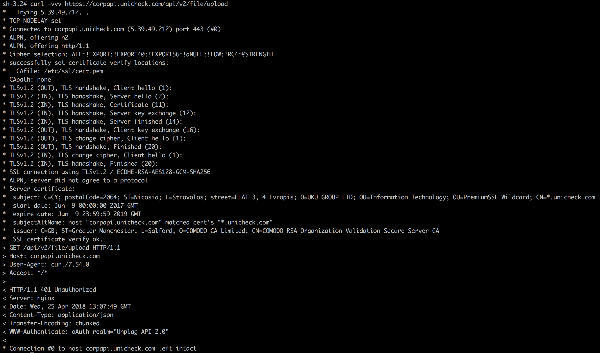

## Network problems
### Failed to connect
Looks like the Moodle host cannot connect to Unicheck at all. It's must have for plugin to operate.
You should check your network configuration.
Maybe:
 * firewall is blocking outbound connections
 * your host does not have access to the internet (gateway is not configured)

At least curl should work, like this

### Error occurred when trying to send this file to Unicheck

Files are in UPLOADING state until cron is run - that is normal behavior. 
Files are processed only in the background, which is done by cron.php in Moodle.

`An error occurred while sending this file to Unicheck` means that Unicheck API request failed and/or response cannot be parsed. 
For Unicheck plugin the causes can be:

* Networking fail
* DNS resolving fail
* Firewall blocks
* Anything, that can prevent plugin reaching Unicheck API

## Cron problems

Unicheck plugin requests to Unicheck service are sent using the [Moodle Cron](https://docs.moodle.org/39/en/Cron).
When students submit their work, we do not immediately send their documents for checking in Unicheck,
the plugin adds an [ad-hoc task](https://docs.moodle.org/dev/Task_API) that will be executed when Moodle Cron script runs.
This is necessary so that users have a minimum latency when working with Unicheck.

### Infinity uploader

#### Out of memory

The maximum file size that the Unicheck system can process is 70 MB. 
For efficient plugin operation, the recommended size of the allocated memory is 256 MB for moodle server in cron processing

#### RAR extension

For supporting RAR archives you have to install php-ext using command `pecl install rar`. 
Find more info on [php.net](http://php.net/manual/en/rar.installation.php).

#### Incorrect CRON configuration. 

Unicheck plugin requires Moodle Cron to be configured to run every minute.
Please find steps on how to configure it in Moodle [documentation]https://docs.moodle.org/39/en/Cron 

## HTTP Callbacks problems

To get the check result from the Unicheck, we use the [webhook functionality](https://en.wikipedia.org/wiki/Webhook).
When the work is sent for checking, the plugin automatically substitutes the callback URL so that Unicheck can return the result immediately after the operation is completed.
This eliminates a lot of unnecessary requests from the client to the server.

The callback URL is formed on CRON by pattern

    $CFG->wwwroot/plugin_callback_endpoint

We use `$CFG->wwwroot` because requests from CLI tool are performed without the participation of the web server and we do not know about the current host on which the Moodle Server is hosted.

After processing the task, Unicheck sends the result back to the callback URL. The result from Unicheck is signed using [OAuth](https://tools.ietf.org/html/rfc5849) so that the plugin can verify the request.

HTTP callback no longer comes to CRON, where it was formed, but to the webserver.
Therefore, it is important that when checking the validity of the request, the server host matches what was sent to the callback URL on CRON.

 > If you do not have the ability to configure verification via OAuth, you can disable it through the appropriate option in the plugin settings.

### OAuth request body signing requires oauth_body_hash
Make sure that your server can accept the `Authorization header`. It contains the data for checking the validity of the request.

### OAuth request failed: Invalid signature
#### Callback URL does not match

The callback endpoint on the Moodle webserver does not match the callback URL formed on CRON.

Make sure that the `$CFG-> wwwroot` value in the CLI tool is the same as on the webserver.

#### API secret does not match

API secret on CLI tool does not match API secret on the webserver